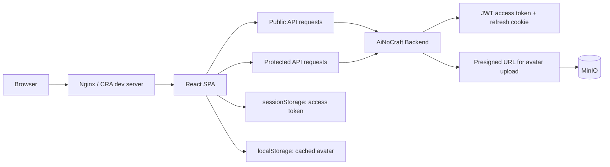

# AiNoCraft Frontend

<p align="center">
	
</p>

<p align="center">
	
	
	
	
	
</p>

<p align="center">
	Frontend-приложение AiNoCraft: лендинг проекта, авторизация, личный кабинет, новости, магазин и страница лаунчера в одном SPA.
</p>

## Обзор

AiNoCraft Frontend — React SPA для сайта игрового проекта AiNoCraft. В одном приложении собраны публичная витрина сервера, страницы входа и регистрации, восстановление пароля, личный кабинет пользователя, витрина привилегий, новости и страница загрузки лаунчера.

Фронтенд работает с backend из соседнего репозитория `AiNoCraft_back` и использует его API для:

- логина, logout и refresh-сессий;
- двухэтапной регистрации через email-код;
- трёхэтапного сброса пароля;
- получения баланса игрока;
- загрузки и получения аватара через presigned URL и MinIO.

## Что уже умеет frontend

- лендинг с hero-секцией, преимуществами, игровыми режимами, галереей, блоком новостей, отзывами и социальными ссылками;
- формы логина и регистрации с клиентской валидацией и проверкой логина/email через API;
- сброс пароля в 3 шага: email -> код подтверждения -> новый пароль;
- защищённый маршрут личного кабинета `/account`;
- получение игрового баланса из backend API;
- загрузку аватара пользователя напрямую в MinIO через backend-issued presigned URL;
- автообновление access token до истечения срока действия;
- синхронизацию аватара между вкладками через `storage` event и пользовательское событие `avatar-updated`;
- отдельные страницы для новостей, документов, магазина, лаунчера и временной заглушки `Coming Soon`.

## Визуальный стиль

<p align="center">
	
	
</p>

Эти изображения уже лежат в репозитории. Их можно использовать как промо-ассеты для README, презентаций, страниц деплоя или будущих лендинговых блоков.

## Архитектура



## Текущий статус интеграций

| Зона | Статус | Комментарий |
| --- | --- | --- |
| Авторизация | Готово | Логин, logout, refresh и protected routes уже подключены |
| Регистрация | Готово | Есть init/verify/resend flow с проверкой login/email |
| Сброс пароля | Готово | Реализован 3-step flow через backend API |
| Личный кабинет | Частично | Баланс и аватар интегрированы, часть полей и статистики пока статические |
| Магазин | Частично | Каталог, детали и корзина есть; checkout пока имитационный |
| Новости | Частично | Страница и модалки готовы, контент сейчас из локальных данных |
| Лаунчер | Готово для витрины | Есть промо-страница, блок скачивания и системные требования |

## Стек

| Слой | Технологии |
| --- | --- |
| UI | React 19, React DOM 19 |
| Маршрутизация | React Router DOM 7 |
| Сборка | Create React App, react-scripts 5 |
| Работа с изображениями | react-easy-crop |
| HTTP/API | собственные `PublicApiService` и `ProtectedApiService` |
| Продакшен-раздача | Nginx |
| Контейнеризация | Docker, Docker Compose |

## Быстрый старт

### Вариант 1. Локальный запуск через Node.js

Подходит для локальной разработки интерфейса, когда нужно быстро проверять изменения.

1. Установите Node.js `18+`.
2. Установите зависимости:

```bash
npm ci
```

3. Создайте файл `.env.local` в корне проекта:

```env
REACT_APP_API_URL=http://localhost:8000/api/v1
```

4. Запустите dev-сервер:

```bash
npm start
```

После запуска приложение будет доступно на `http://localhost:3000`.

> Для полноценной работы нужен запущенный backend AiNoCraft с корректно настроенным CORS и API по пути `/api/v1`.

### Вариант 2. Разработка через Docker Compose

Если удобнее работать в контейнере:

```bash
docker compose -f docker-compose.dev.yml up --build
```

Этот сценарий использует `Dockerfile.dev`, монтирует текущую директорию в контейнер и по умолчанию прокидывает:

```env
REACT_APP_API_URL=http://localhost:8000/api/v1
```

### Вариант 3. Production build

Сборка production-образа из текущего checkout:

```bash
docker build -t ainocraft-frontend --build-arg REACT_APP_API_URL=https://api.ainocraft.com/api/v1 .
docker run -p 8080:80 ainocraft-frontend
```

После запуска production-сборка будет доступна на `http://localhost:8080`.

> Учтите: `docker-compose.prod.yml` сейчас запускает образ `ghcr.io/ainocraft/ainocraft-frontend:latest`, а не собирает приложение из локального репозитория.

## Переменные окружения

Фронтенд использует одну ключевую переменную окружения:

| Переменная | Назначение | Пример |
| --- | --- | --- |
| `REACT_APP_API_URL` | базовый URL backend API | `http://localhost:8000/api/v1` |

Если переменная не задана, приложение берёт fallback-значение:

```text
https://api.ainocraft.com/api/v1
```

Это значение задано в `src/services/core/ApiConfig.js`.

## Как устроена аутентификация на фронтенде

| Механика | Как работает |
| --- | --- |
| Access token | хранится в `sessionStorage` |
| Refresh | выполняется через backend endpoint `/refresh`, токен обновляется заранее до истечения |
| Protected routes | маршрут `/account` закрыт через `ProtectedRoute` |
| Сброс auth state | при невалидной сессии контекст сбрасывает пользователя и кэш |
| Кэш аватара | хранится в `localStorage` и синхронизируется между вкладками |
| Upload avatar | backend отдаёт presigned URL, фронтенд загружает файл напрямую в MinIO и подтверждает загрузку |

## Основные маршруты

| Маршрут | Назначение | Доступ |
| --- | --- | --- |
| `/` | главная страница проекта | public |
| `/login` | вход пользователя | public |
| `/register` | регистрация + подтверждение email | public |
| `/reset-password` | восстановление пароля | public |
| `/shop` | витрина привилегий и корзина | public |
| `/news` | список новостей и modal-view по `newsId` | public |
| `/terms` | документы сервера | public |
| `/launcher` | страница лаунчера и системных требований | public |
| `/coming-soon` | заглушка для будущих возможностей | public |
| `/account` | личный кабинет игрока | protected |

## Основные сервисы API

| Сервис | Ответственность |
| --- | --- |
| `auth/AuthService` | login, register, verify, refresh, logout, проверка login/email |
| `auth/ResetPasswordService` | init, verify и finalize для восстановления пароля |
| `user/UserService` | баланс, аватар, смена пароля, upload flow через MinIO |
| `core/PublicApiService` | публичные HTTP-запросы без access token |
| `core/ProtectedApiService` | запросы с access token и защищёнными endpoint'ами |

## Структура проекта

```text
src/
	App.jsx                 # маршруты приложения и общая оболочка
	index.js                # точка входа React
	assets/                 # изображения и визуальные ассеты
	components/             # UI-компоненты по доменам
	contexts/               # AuthContext и глобальное состояние
	data/                   # локальные данные для новостей и контента
	pages/                  # маршрутные страницы
	services/               # HTTP-клиенты, auth и user API
	styles/                 # глобальные и page-level стили
	utils/                  # вспомогательные функции и валидация
Dockerfile               # production-сборка на Node + Nginx
Dockerfile.dev           # dev-контейнер для локальной разработки
docker-compose.dev.yml   # docker-сценарий разработки
docker-compose.prod.yml  # docker-сценарий запуска опубликованного образа
nginx.conf               # SPA fallback и кэширование статики
```

## Полезные команды

```bash
npm start          # dev-сервер
npm run build      # production build в папку build/
npm test           # тестовый раннер CRA
docker compose -f docker-compose.dev.yml up --build
docker build -t ainocraft-frontend --build-arg REACT_APP_API_URL=http://localhost:8000/api/v1 .
```
